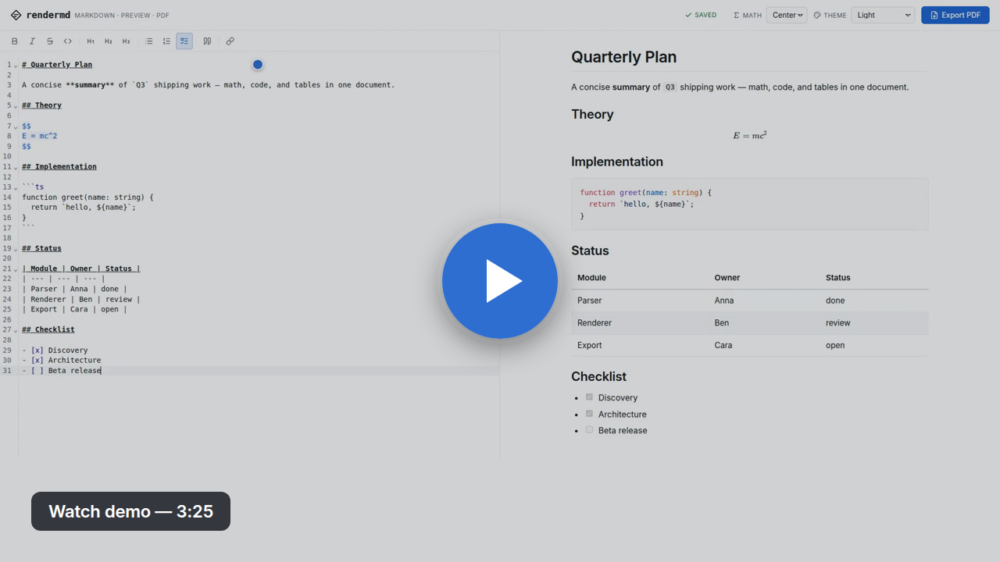
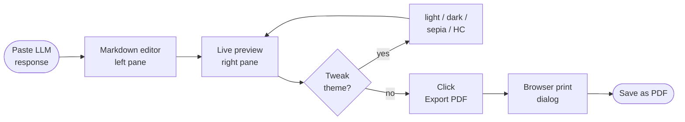

# rendermd

[](https://github.com/boostcampwm-snu-2026-1/rendermd-hyuk/actions/workflows/ci.yml)
[](./LICENSE)
[](./.nvmrc)
[](./package.json)

A static web tool to preview LLM-generated markdown in real time and save it as a PDF.

> **Live:** <https://boostcampwm-snu-2026-1.github.io/rendermd-hyuk/>

> Boostcamp Web & Mobile SNU 2026 — solo project (3-week shared track)

## Development setup

- Node.js `>=22`
- pnpm `>=9`

```bash
pnpm install      # install deps and activate Husky hooks
pnpm dev          # dev server (available after Next.js setup in week 2)
pnpm build        # static build → out/ (week 2+)
pnpm format       # apply Prettier
pnpm format:check # check formatting (used by CI)
pnpm test         # run Vitest (watch mode)
pnpm test:run     # run Vitest once (used by CI)
```

## Tech stack

Next.js (static export) · TypeScript · CodeMirror 6 · react-markdown · KaTeX · CSS Modules · **pnpm** · **Husky** · **Vitest** · **commitlint** · GitHub Actions

Rationale: [docs/proposal.md](./docs/proposal.md)

## Documentation

- [Project proposal](./docs/proposal.md)
- [Workflow draft](./docs/workflow.md)
- Retrospectives: [week 1](./docs/retrospective.md), [week 2](./docs/retrospective-week2.md), [week 3](./docs/retrospective-week3.md)
- [Contributing guide](./CONTRIBUTING.md)

## Demo

### Walkthrough video

[](https://github.com/boostcampwm-snu-2026-1/rendermd-hyuk/releases/download/demo-v1/demo.mp4)

Narrated 3:25 walkthrough — paste, live preview, toolbar formatting, slash menu, themes, math alignment, and PDF export. 1920×1080 · H.264 · 12 MB.

### User flow



### Screenshots

Captured from the live site via `pnpm dlx tsx scripts/capture.ts` (Playwright).

|                   | Desktop (1440×900)                                     | Mobile (390×844)                                     |
| ----------------- | ------------------------------------------------------ | ---------------------------------------------------- |
| **Light**         |  |  |
| **Dark**          |    |    |
| **Sepia**         |  |  |
| **High contrast** |        |        |

PDF samples (themed): [light](./docs/screenshots/pdf-light.pdf) · [dark](./docs/screenshots/pdf-dark.pdf)

## Branch strategy

```
main         ← deployed (GitHub Pages auto-deploy)
 ↑
dev          ← integration
 ↑
feature/*    ← per-feature
```

- No direct pushes to `main`.
- `feature/*` PRs merge into `dev`.
- `dev` → `main` PRs trigger auto deploy.

## Commits

Follows [Conventional Commits](https://www.conventionalcommits.org/). The Husky `commit-msg` hook runs `commitlint` and rejects non-conforming messages.

Example: `feat(editor): add CodeMirror markdown highlighting`

See [CONTRIBUTING.md](./CONTRIBUTING.md) for the full format.

## Author

- 최재혁 / jay20012024

## License

[MIT](./LICENSE)
